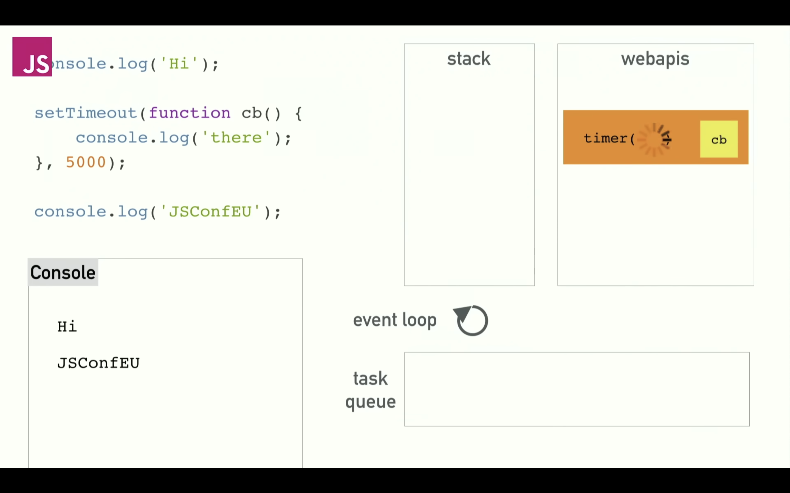
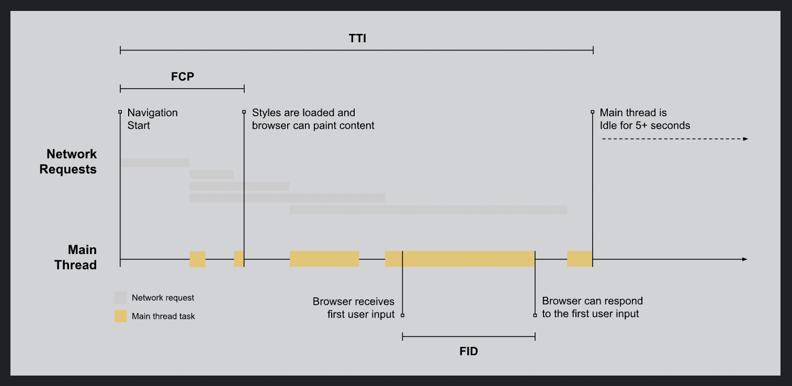
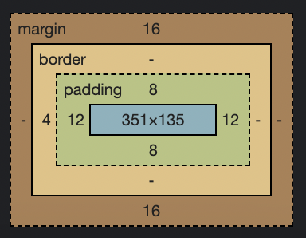
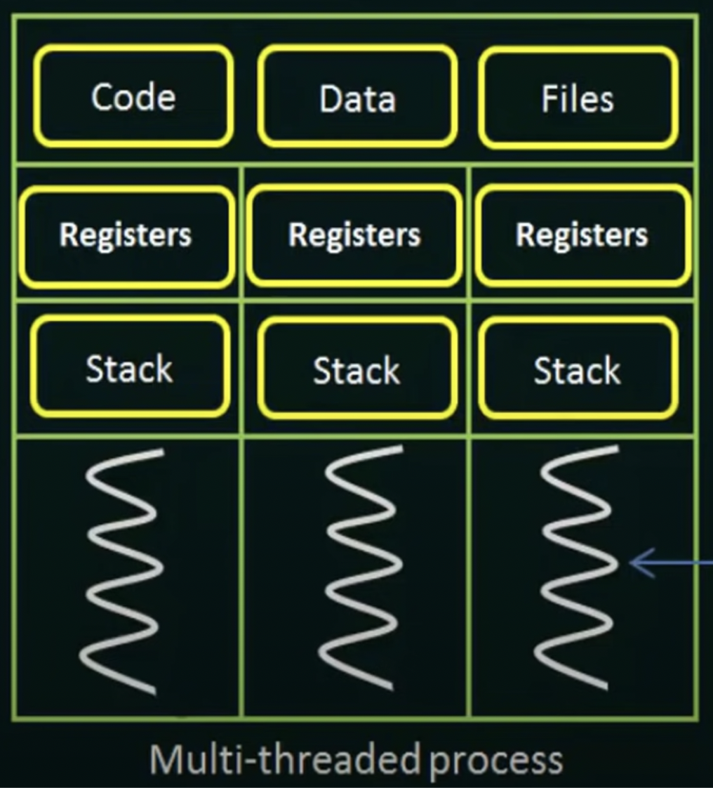

# UI Tech

## Resources
* https://alphaayush.notion.site/alphaayush/2e13395deff94a428d45b3aa88dc7ee7?v=06b5c5617b8442bc878bd210257786ad
* https://github.com/lydiahallie/javascript-questions/blob/master/README.md

## Frontend Security
* SSL - Secure Sockets Layer - An encryption technique used to safeguard the communication between the server and the client, without it, sensitive information is subject to theft. This is pretty much a standard requirement now.
* Cross Site Scripting (XSS)
* CSRF
* Clickjacking
* CSP - Content Security Policies
* CORS - Cross Origin Resource Sharing
* Auth

## Web and Browser Fundamentals
### Explain the entire process (what actually happens in backend) starting from sending request from client to server and then back to client.
* https://developer.mozilla.org/en-US/docs/Web/Performance/How_browsers_work

### Event Capture, Target, Bubbling, Delegation
* When you click for example, the browser does not straight away know which element received the event
* It knows that a click event occured, so it starts from the root, all the way down to the element that received the event - This is called event capturing phase
* The target element is isolated and the browser checks if an event handler is registered with it - This is called the target phase
* If an event handler is registered, the event starts to bubble from the target all the way up to the root and all parental event listeners are also triggered unless the event propagation is manually stopped
* This bubbling of the events up the DOM can be used to implement a technique called delegation, in delegation a common parent is delegated to deal with events triggered on the children, for example:
* Imagine you have several buttons inside a div and you want to log the button text when each button is clicked
* One way is to attach a click event listener on each button, this will lead to several event handlers doing the same thing!!
* Instead we can add a single event listener to the parent like this:
```html
<div class="buttons-container">
	<button>Button 1</button>
	<button>Button 2</button>
	<button>Button 3</button>
	<button>Button 4</button>
</div>
```
```javascript
const container = document.querySelector(".buttons-container");
container.addEventListener("click", (event) => {
	if(event.target.tagName === "BUTTON"){
		console.log(event.target.innerText);
	}
});
```
* Now a single event listener handles all the buttons!!! Thus, event delegation is an efficient way of handling similar events

### Event Loop and How Promises and setTimeout are Queued


* JS is a synchronous, single-threaded language which means it can only do 1 thing at a time, so how can it perform concurrent async operations?
* The answer is the Event Loop and Web APIs (in browsers) or C++ APIs in Node which handle concurrent operations in separate threads
* The JS runtime environment has the call stack and any function/method called is pushed on to the call stack and popped after it has been executed
* The JS V8 engine is unable to perform any other operation while the call stack is executing a function
* This means that if we add a lot of slow code to the call stack (slow code could even be something like a while loop from 0 to 100000), the UI will essentially freeze and our clicks and actions will seem to not work, then when the call stack becomes empty again, the browser will execute all our clicks or actions which earlier did not seem to respond!
* Imagine we are getting data from the network which is a slow operation:

```javascript
getSyncData1(); // 5 seconds
getSyncData2(); // 3 seconds
getSyncData3(); // 10 seconds

// If this was done synchronously, the call stack would be busy for 18 seconds!!!! All inputs/clicks/actions will seem like frozen and delayed
// Even the render will not occur, cause even the render function needs an empty call stack to work, remember usual FPS is 60, so browser needs to
// paint every 16ms approximately for a smooth UI and smooth animation experience, otherwise the user will experience jank
```

* Remember that APIs like setTimeout, ajax, DOM etc. are not part of the V8 Engine but they are provided by the browser and run on other threads, this enables concurrency
* The browser maintains 2 queues - Microtask queue and Macrotask queue
	* Microtask queue - Promise and mutation observer callbacks, even the fetch API since it returns a promise
	* Macrotask queue - Browser API callbacks such as DOM event handlers, setTimeout, ajax etc.
* The event loop is responsible to check the call stack, when it is empty, it will dequeue and push all microtasks to the call stack first since they have higher priority and then push macrotasks onto the call stack
* In this way, every loop of the event loop a callback (micro or macro if micro are finished) is pushed to the stack and executed
* In this way, JS is non-blocking and this leads to smooth UI experiences
* If we have slow synchronous code too, for example:
```javascript
function sleep(milliseconds) {
  const date = Date.now();
  let currentDate = null;
  do {
    currentDate = Date.now();
  } while (currentDate - date < milliseconds);
}

for(let i = 0; i < 10; i++){
	console.log("Processing")
	sleep(1000);
}
```
* It is better to create an async version of it and utilise the non-blocking power of the Event Loop, this will not block the render() and will not lead to jank or low responsiveness, remember that render() is not blocked cause it is given priority, so between event loop iterations, it can be called when the stack is momentarily empty
```javascript
function sleep(milliseconds) {
  const date = Date.now();
  let currentDate = null;
  do {
    currentDate = Date.now();
  } while (currentDate - date < milliseconds);
}

for(let i = 0; i < 10; i++){
	// This will push the slow sync callback to the macrotask queue
	setTimeout(() => {
		console.log("Processing");
		sleep(1000);
	}, 0);
}
```
* Full fledged effect of the Event Loop and the difference between micro and macro tasks can be understood here:
```javascript
setTimeout(() => {
	console.log(1);
}, 0)

new Promise(resolve => resolve(2)).then(res => console.log(res));

new Promise(resolve => resolve(3)).then(res => console.log(res));

setTimeout(() => {
	console.log(4);
}, 0)

new Promise(resolve => resolve(5)).then(res => setTimeout(() => console.log(res), 0));

new Promise(resolve => resolve(6)).then(res => console.log(res));

/*
	Output - 2 3 6 1 4 5
  
  Explanation:
	Macrotask Queue - log(1), log(4)
  Microtask Queue - log(2), log(3), 
  callback with setTimeout for log(5), log(6)
  
  Now the event loop in 1 cycle tries to finish all microtasks and 
  then takes 1 macrotask and adds to callstack when it is empty
  
  After finishing all microtasks:
	Output - 2 3 6
  Note that the third callback is executed and its result was
  to add log(5) with a setTimeout, this setTimeout is now 
  pushed to macrotask queue
  
  Final macrotask queue - log(1), log(2), log(5)
  Now microtask queue is empty, event loop will take each log
  function in macrotask queue and execute it in each loop
  
  Final console output - 2 3 6 1 4 5
*/
```

### Web Performance
* Key Web Performance Metrics (Can calculate them from tools such as lighthouse)
	* Cummulative Layout Shift (CLS) - How much the layout shifts until the render is complete 
		* If images load and move elements around them for example, this can lead to a bad CLS score, you should always set height and width on image elements on their containers
	* Largest Contentful Paint (LCP) - Time to load the largest asset
		* Use next generation formats such as webp
		* Compress asset size
		* Preload LCP asset
	* Time to Interactive (TTI) - The point in time when the long task has finished (tasks that occupy the UI thread for 50ms or more) followed by a 5 second period of network and main thread inactivity. It helps identify scenarios where a page might appear interactive but actually isn't cause the resources needed to respond to user interaction adequately have not been loaded.
		* Preconnect to required origins
		* Reduce main thread work
		* Minify JS
		* Preload critical requests
		* Keep request count low and transfer sizes small
		* Reduce JS execution time
		* Reduce the impact of third party code
	* Total Blocking Time (TBT) - The total time the render process is blocked due to for example, loading of scripts etc.
		* Use defer on scripts or move them at the end of the body tag
		* async and defer are different - async will start loading the script and execute it as soon as it is loaded, defer will start loading the script but will not execute it before the render is complete, also deferred scripts are executed in the order in which they appear in document
	* First Contentful Paint (FCP) - The time taken for for the user to see ANY content on the browser
		* This can be improved using a preloader which shows much before your LCP
		* Inline critical CSS
		* Improve server response time - TTFB (Time to first byte)
		* Avoid script based elements above the fold
		* Avoid lazy loading images above the fold
		* Ensure text remains visible during webfont load
			* Browsers might not show any font until all font files are loaded, this can cause FLash of Invisible Text (FOIT), to prevent this add font-display: swap in your font-face or &display=swap if loading from a CDN such as google fonts. This will show a system font until your fonts load.
		* Eliminate render blocking resources
	* Speed Index - The speed at which above the fold content visually loads
		* Minimize main thread work
		* Reduce JavaScript execution time
		* Ensure text remains visible during webfont load
	* First Input Delay (FID) - This refers to the delay between first input received by the browser and the actual time after which the browser is able to respond to the input. It is a measure of responsiveness of the site. After, FCP and before the main thread is idle (TTI point), if a user clicks or does some other such action, the main thread might be busy (it might be executing some JS files it just downloaded etc.), this might cause the browser to exhibit a delay in responding to the user action.
		* Minimize main thread work
		* Keep requests low and transfer sizes small
		* Reduce JS execution time



### Service workers and web workers

## REST API Methods
* GET - Idempotent, safe, no body, used only to retrieve information from the server
* POST - Non-idempotent, unsafe, has body, used to create new entry to the DB, or change in state or cause side effects on the server
* PUT - Idempotent, unsafe, has body, used to replace all target resource values with the data in the request body
* DELETE - Idempotent, unsafe, used to delete a particular resource from DB
* OPTIONS - Idempotent, safe, is used to check permissible options for communication with the server, client can mention a URL or use * to refer to the entire server
* PATCH - Non-idempotent, unsafe, is used to carry out partial modifications to a resource
* Idempotent means that no matter how many times a request is carried out, there are no additional side effects than which occured the first time
* PATCH is not always idempotent, however, it can be but PUT is always idempotent, PATCH has instructions to modify a resource whereas PUT is the whole modification itself
* PUT is idempotent but POST is not. Calling POST multiple times can have multiple side-effects like duplicate entries getting created in the DB.

## HTML
### Questions
* What does DOCTYPE do?
	* DOCTYPE -> Document Type Definition (DTD)
	* Defines the structure rules of the document
	* Browsers trigger no-quirks mode for particular DTD
	* For HTML5:
	```html
	<!DOCTYPE html>
	```
* What is Charset Meta Tag?
* Serve page in multiple languages
	* lang attribute in html tag
	* hreflang in link to tell search engines that page exists in multiple languages
	* i18n placeholders
	* Allow to change language easily
	* Dates and time could change
	* Colors could change
	* Text direction and even width could change
	* May need to swap images with embedded text
	* Accept-Language header is sent to server
	* Show locale in url
	* Do not concatenate translated strings as this may not be gramatically correct
* data- attributes
	* Can be changes easily in inspect
	* Available in dataset
	* Better to keep data in JS binded using framework or library
	* Could be useful for testing libs
* Building blocks of HTML5
	* Audio/Video
	* 2D/3D graphics
	* Better performance
	* Better ways of connecting with the server
	* More semantic elements
	* More web APIs
	* Offline and storage
	* More verbose styling and themes
	* Device access
* Cookie, sessionStorage and localStorage
	* Session, local - 5mbs, not sent to server
	* Cookie - 4kb, sent to server
	* You know the rest
* Describe the difference between <script>, <script async> and <script defer>
	* script - block render
	* async - loads script in parallel, executes immediately
	* defer - loads script in parallel, executes after HTML parsing in order of appearance
* Why is it generally a good idea to position CSS <link>s between <head></head> and JS <script>s just before </body>? Do you know any exceptions?
	* HTML -> DOM and CSS -> CSSOM
	* CSSOM generation is delayed if stylesheets are not in head
* Progressive rendering - Techniques to improve perceived load time
	* Lazy loading images
	* Prioritising content above fold
	* Using onload event or DOMContentLoaded event to load below fold content after above fold is loaded
	* Async HTML fragments - Flushing parts of the HTML to the browser as the page is constructed on the back end
* srcset attribute in images
	* To serve different images for different device widths and pixel density
	```html
	
	```
	* Pixel density of retina displays could be 2
	* Suppose device width is 320px
		* 500 / 320 = 1.5625
		* 1000 / 320 = 3.125
		* 2000 / 320 = 6.25
	* For normal display small.jps is chosen, for retina display (2x), medium.jpg is chosen

### Semantic HTML
* Semantic HTML is using elements which clearly indicate the purpose of the content within, for example:
```html
<article>
<section>
<heading>
```
* It makes it easier for assistive technologies to understand your page

### Accessibility
* a11y rules for accessibility
* In my experience, using proper aria-label attributes for buttons, using proper alt text for images, using semantic HTML, improves accessibility

## CSS
### Position Property
* Static - Default. The elements is positioned as in natural flow of the document.
* Absolute - The element is positioned w.r.t the closest positioned (non-staic) ancestor
* Relative - The element is positioned w.r.t its natural position
* Fixed - The element is positioned w.r.t the window
* Sticky - The element is positioned relative initially and then when user scrolls and a certain offset is passed, the element takes the position fixed

### Selectors
* ID selector
```css
#submit-button {
  color: red;
}
```
* Class selector
```css
.submit-button {
  color: red;
}
```
* Element or tag selector
```css
button {
  color: red;
}
```
* Child selectors
```css
.test > p {
  color: red;
}
	
.test:nth-child(2) { // also first-child and last-child, nth child is considered slow
  color: red;
}
```
* Selecting all nested children
```css
.parent-class .child-class {
  color: red;
}
```
* Sibling selectors
* Attribute selectors
```css
[data-component="a3-icon"]{
  color: red;
}
```

### Specificity
* a b c d (left overpowers right)
	* a - inline styling, 0 or 1
	* b - number of id selectors
	* c - number of class, attribute and pseudo-class selectors
	* d - number of element and pseudo-element selectors
* If specificity is the same, the rule which appears more at the bottom is considered more specific

### Box Model
* Box model is responsible for calulating width and height and collapsing of any borders or margins and how elements are positioned next to each other
* A box with no width will take all horizontal space
* width and height depend on the content
* Default width and height only include content-box but with box-sizing: border-box this can be overridden to include padding and borders

	
### Floats
* https://css-tricks.com/all-about-floats/
	
### Questions
* What's the difference between "resetting" and "normalizing" CSS? Which would you choose, and why?
	* Resetting - remove all default styles
	* normalizing - keep some useful styles and even fixes known bugs for common browser dependencies
* Describe z-index and how stacking context is formed.
	* z-index stacks w.r.t parent not root
	* B is on top of A, A and B are siblings, no way that a child of A can ever be on top of B
	* Stacking contexts are independent and self-contained
	* z-index only works on positioned elements (not static)
* Describe Block Formatting Context (BFC) and how it works. - Need more clarity
* What are the various clearing techniques and which is appropriate for what context?
	* class:
	```css
	.clearfix::after{
		content: '';
		height: 0;
		visibility: hidden;
		display: block;
		clear: both;
	}
	```
	* empty div with style="clear: both;"
	* using overflow: hidden or overflow: auto on parent
* Explain CSS sprites, and how you would implement them on a page or site.
	* Multiple images stitched into 1 and used with a class having background-image, background-position and background-size
* How would you approach fixing browser-specific styling issues?
	* Use a UI library like Bootstrap which already handle these issues
	* Use reset or normalize css
	* use autoprefixer for auto prefixing of vendor prefixes
	* Use caniuse for compatiblity check
	* Load a separate stylesheet for that particular browser
	* Use a preprocessor
* How do you serve your pages for feature-constrained browsers? What techniques/processes do you use?
	* Graceful degradation - Develop for modern browsers, make sure backward compatibility is there
	* Progressive development - Develop for basic features, add features as they are supported
	* Use caniuse
	* Use feature checking with modernizr
	* Use @support css rule to check for css feature support
* What are the different ways to visually hide content (and make it available only for screen readers)
	* Position it outside screen using absolute - Method of choice
	* Make its height and width 0
	* Use W3C specifications
	* Use meta tags
	* Use text-indent (only works for text inside blocks) - Performance considerations, use text-indent: 100%;
* Can you give an example of an @media property other than screen?
	* all
	* print
	* speech
	* screen
* What are some of the "gotchas" for writing efficient CSS?
	* Do not use tag selectors or global selectors
	* Keep the selector chain short
	* Use specific classes for all elements and if there is heirarchy, embed it in the classname according to the Block Element Modifier Methodology
	* Avoid rules that change layout or trigger reflow or repaint
	* Do not use !important
	* DRY principle
	* Use multiple stylesheets
	* Be consistent with naming and reusing classes
	* Reuse classes in the class attribute
	* Use shorthands
	* Avoid unnecessary CSS
	* Do not position elements until absolutely needed to
* Can use @font-face for custom fonts, remember to use font-display: swap;
* Explain how a browser determines what elements match a CSS selector
	* Browser will match elements from right to left of the selector chain, they will shortlist all elements with the rightmost key selector and then move to parents to determine if the element matches the entire selector chain
	* For example "p span", first browser will collect all span elements then look if each span has a p ancestor up until root
	* That is why avoid global or tag selectors
* pseudo-elements - Keywords addd after selectors to style a particular part of an element, eg - ::first-line, ::first-letter, can even be used to add elements to the DOM using ::after and ::before, tooltip arrows use these only
* pseudo-classes - Used to style a particular state of an element, :hover, :active, :visited etc.
* What is the CSS display property and can you give a few examples of its use?
	* none (removes from DOM), block, inline-block, inline, flex, grid, table, table-cell, table-row, list-item
* What's the difference between inline and inline-block and block?
	* inline and inline-block and height and width based on content
	* block has width of entire parent minus padding
	* block and inline-block allow height and width to be defined, inline doesnt
	* block and inline-block respect all margins, paddings, inline only respects horizontal
	* Can be aligned with vertical-align? - yes for both inline ones and no for block
* Can you explain the difference between coding a website to be responsive versus using a mobile-first strategy?
	* Both are related
	* Mobile-first is more performant for mobiles
* How is responsive design different from adaptive design?
	* Responsive is one ball resizes for different hoops - Media Queries to adjust to widths
	* Adaptive is different balls for different hoops - Client sniffing and serving different content for different clients
* Have you ever worked with retina graphics? If so, when and what techniques did you use?
	* Marketing name for displays with pixel density greater than 1
	* Use img srcset and sizes attributes
* Is there any reason you'd want to use translate() instead of absolute positioning, or vice-versa? And why?
	* translate does not cause reflow or repaint but causes composition, faster paint and better performance than absolute positioning which causes reflow
	* Absolute uses CPU, translate uses GPU

## JavaScript
* Remember JS is a synchronous single-threaded language but the browser event-loop and promises makes it exhibit async functionality
* Synchronous means that the code is executed in the sequence in which it is written, waiting for the previous instruction to finish executing
* Remeber that JS is not static typed but dynamically which means that a variable is not attached to a particular data type, you can do this in JS:
```javascript
const a = "Abhinav";
a = 12; // No error
```
* Remember you can pass excessive arguments to functions in JS and it will not throw and error unlike other languages such as Java
```javascript
function printName(first, last){
	console.log(first + " " + last);
}

printName("Rahul", "Chabra", "Friend"); // no error, output - Rahul Chabra
```

### Some general things to remember
* array.slice(start, end) // Will return a new array without modifying the original, end is non-inclusive
* array.splice(index, howmany, item1, ....., itemX) // modifies the original array, itemN are items to be added

### Data Types
* Primitive - Can store only 1 type at a time
  * number - Integers and floating points both
    * infinity and NaN are special type of numbers
  * big int - When numbers are not enough, rarely needed
  * string
    * Remember strings are immutable in JS!!!!!!! I have made this silly mistake before too, if they were not then any hacker could alter them and change references causing security breaches.
    * There is practically no difference between single and double quotes in JS
    * Backticks (feature of ES6) however allow us to define template strings with variables inside strings such as:
    ```javascript
    const info = `${name} is ${age} years old`;
    ```
  * boolean - true or false
  * null - Means a value is not known
  * undefined - Means a variable has been declared but its value has not been defined yet
    * null and undefined are different in this sense that null is still an assigned value, it is just that the value is unknown
* objects - Can store collection of data and more complex entities
* symbols - Are used to create unique identifiers for objects (probably not that important)

### Difference between var, let and const - let and const are features of ES6
* var
  * Var is either global scoped or function scoped, if declared outside function, it is global scoped, if declared inside function, it is function scoped and it will not be accessible outside that function
  * var can be used to redelcare the same variable!
  * Variables declared using var can be reassigned
  * Variables declared with var can be accessed in their scope before they are declared although the value is always undefined (hoisting)
* let and const
  * Both are block scoped and cannot be accessed outside the block
  ```javascript
  let a = 10;
    function f() {
        if (true) {
            let b = 9
 
            // It prints 9
            console.log(b);
        }
 
        // It gives error as it
        // defined in if block
        console.log(b);
    }
    f()
 
    // It prints 10
    console.log(a)
  ```
  * But as they are only block scoped, you can declare same variable name in different blocks using let and const - DO NOT GET CONFUSED HERE!
  ```javascript
  let a = 10
  if (true) {
    let a = 9
    console.log(a) // It prints 9
  }
  console.log(a) // It prints 10
  ```
  * Let variables can be reassigned but const cannot, however for const objects we can alter object property values but not the properties themselves, we can even add properties! Again do not confused here.
  ```javascript
  const dog = {
  	name: "oreo"
  }
  dog.age = 12;

  console.log(dog); // age will be added as a property
  ```
  * You cannot access let and cost variables before they are declared, you will get ReferenceError

### Promises, callbacks, async, await
* Promises are objects which represent the eventual success or failure of an asynchronous operation
* Three states:
	* Pending
	* Fulfilled
	* Rejected
* Promises solve the issue of the callback hell which was created when multiple operations had to be done one after the other, several callbacks had to be sent inside nested functions which looks ugly and confusing
```javascript
doTask1(function(res1){
	doTask2(res1, function(res2){
		doTask3(res2, function(finalRes){
			console.log(finalResult);
		}, errorCallback)
	}, errorCallback)
}, errorCallback)
```
* Promises aim to solve this problem using promise chaining
```javascript
doTask1()
.then((res1) => doTask2(res1))
.then((res2) => doTask3(res2))
.then((finalRes) => console.log(finalRes))
.catch((error) => console.log(error));
```
* Remember to return the next promise from the callback else you will break the promise chain!
* Remember promises are guaranteed to be asynchronous and their callbacks will only be called once the call stack is empty even when a callback is attached to an already resolved promise!
```javascript
Promise.resolve(3).then((res) => console.log(res));
console.log(4);
// Output - 4 3
```
* Remember that the rejection of a promise in the chain will go to the next catch handler in the chain
* Always terminate your promise chain with a catch handler otherwise you will get unhandledRejection
* You can also nest promises but this should be avoided unless there is good reason to do so, keep the promise chain flat!
```javascript
doTask1()
.then((res) => 
	doLessImportantTask(res)
	.then((lessImpRes) => doMoreLessImportantTask(lessImpRes))
	.catch((error) => console.log("Less important had error but it does not matter."))
	// Remember the scope of a nested catch handler is always limited as is intentional here, it can only catch errors from these less important
	// tasks, we do not want these less important tasks to fail the main chain
)
.then((res2) => doCriticalTask(res2))
.catch((error) => console.log("Critical failure occured!"));
```
* Remember you can even continue the chain after a catch statement
```javascript
New Promise((resolve) => {
	console.log("Initial")
	resolve();
})
.then(res => {
	throw new Error("Something went wrong");
	console.log("Do this");
})
.catch((error) => console.log("Do this now"))
.then(() => console.log("Do this no matter what happened before"))
.catch((error) => console.log("Do this again"))
	
/*
Output:
Initial
Do this now
Do this no matter what happened before
*/
```
* Async/Await syntax
```javascript
async function execute(initia̵lVal){
	try {
		const res1 = await doTask1(initia̵lVal);
		const res2 = await doTask2(res1);
		const finalResult = await doTask3(res2);
		console.log(finalResult);
	} catch(error){
		console.log(error);
	}
}
```
* Promise callbacks are handled as a microtask whereas setTimeout() callbacks are handled as task queues.
* 4 Concurrency methods
	* Promise.all - Fulfills when all fulfill, rejects if any 1 rejects
	* Promise.allSettled - Settles when all settle whether any fulfills or rejects
	* Promise.any - Fulfills if any 1 fulfills, rejects if all reject
	* Promise.race - Settles when any 1 first settles whether it settles as fulfilled or rejected

### Polyfill for Promise.all
```javascript
function promiseAll(promises) {
  return new Promise((resolve, reject) => {
    const resArray = [];
    let settled = 0;
    for (let i = 0; i < promises.length; i++) {
      Promise.resolve(promises[i])
        .then(res => {
          resArray[i] = res;
          settled++;
          if (settled === promises.length) resolve(resArray);
        })
        .catch(error => reject(error));
    }
  });
}
```
	
### Polyfill for Promise.allSettled
```javascript
function promiseAllSettled(promises) {
  return new Promise((resolve) => {
    const resArray = [];
    let settled = 0;
    for (let i = 0; i < promises.length; i++) {
      Promise.resolve(promises[i])
        .then(res => {
          resArray[i] = res;
          settled++;
          if (settled === promises.length) resolve(resArray);
        })
        .catch(error => {
          resArray[i] = error;
          settled++;
          if (settled === promises.length) resolve(resArray);
        });
    }
  });
}
```
	
### pollyfill for Promise.race
```javascript
function racePromises(promises) {
  return new Promise((resolve, reject) => {
    for (let i = 0; i < promises.length; i++) {
      Promise.resolve(promises[i])
        .then(res => resolve(res))
        .catch(error => reject(error));
    }
  });
}
```

* How does javascript figures out that a promise is resolved?
* Implement Promise.all
* Implement an array of promises in parallel
* Implement an array of promises one after the other

### Function call, bind, apply
```javascript
const printInfo = function(state, country){
  console.log(this.name + " is from " + this.city + " and " + state + " and " + country);
}

const person1 = {
  name: "Abhinav"
  city: "Amritsar"
}

const person2 = {
  name: "Rahul"
  city: "Chandigarh"
}

printInfo.call(person1, "Punjab", "India"); // Output - Abhinav is from Amritsar and Punjab and India
printInfo.apply(person1, ["Punjab", "India"]); // Output - Abhinav is from Amritsar and Punjab and India

const boundedFunc = printInfo.bind(person1, "Punjab");
boundedFunc("India"); // Output - Abhinav is from Amritsar and Punjab and India
```
* call is used to invoke a function with a given context to which "this" points to and function arguments are passed as comma separated values
* apply is the SAME as call, the only difference is that in apply, function arguments are passed as an array
* bind returns a function which has its "this" pointing towards the provided scope, additional function parameters can be passed as comma separated values which will be passed to the bounded function on invoking it. All arguments need not be there when doing a bind. Rest of them can be passed in the bounded function upon invoking it. See above code.

### Dynamic Dispatch
* Just a fancy term which means calling methods on objects, the origin of this term is from older languages where calling methods on objects was called as sending messages to the object
* In JS we say Dynamic dispatch cause when we call the method, for example, obj.method(), the engine does not know exactly which function in memory to call, it has to first search the right function and might have to look down the prototype chain
* In some other lower level languages such as C++, static dispatch is found as the program knows exactly which function to call in memory

### Currying
* Currying is a concept where a function is broken down into smaller functions each of which takes one argument and returns a function which waits for the second argument and so on till all arguments are provided.
* It is a way to make sure that we have everything beforehand
* So with currying - func(a, b, c) will be split into func(a)(b)(c)
* There can be 2 ways of creating a curried function:
* Closures:
```javascript
const sum = (a,b,c) => console.log(a + b + c);

const cs = (a) => {
	return (b) => {
		return (c) => {
			console.log(a + b + c);
		}
	}
}

cs(1)(2)(3);
```
* bind method:
```javascript
// const add = (a, b, c) => a+b+c
// Implement curriedSum such that all invokations to cs should return answer as 9
// Gave a hint: fn.length gives no of arguments that function takes . eg: in our case add.length = 3
// const cs = curriedSum(add);
// cs(2)(3, 4) 
// cs(2, 3, 4)
// cs(2, 3)(4)
// cs(2)(3)(4)

const curry = (func) => {
	return curried = (...args) => {
  	if(args.length < func.length){
    	return curried.bind(this, ...args);
    }
    func(...args);
  }
}

const sum = (a,b,c) => console.log(a + b + c);

const curriedSum = curry(sum);
curriedSum(1)(5)(3); // 9
curriedSum(1, 5)(3); // 9
curriedSum(1)(5, 3); // 9
curriedSum(1, 5, 3); // 9
```
* Another question related to currying (asked in Amazon) - create a function "sum" which can be called sum(1)(2)(3)(4).....() to return the sum of all the numbers used as inputs
```javascript
const sum = (num1) => {
	return (num2) => {
		if(num2){
			return sum(num1 + num2);
		}
		return num1;
	}
}
```

### Hoisting
* In hoisting, it appears that the interpretor moves the declarations of functions, classes and variables to the top of their scope before executing the code such that their value or declaration is accessible before the line at which they are defined.
* There are 3 types of hoisting:
  1. Value hoisting - The value of the declaration is accessible before it is actually declared. This is true for functions, generator functions, async functions and async generator functions.
  ```javascript
  calc(5,10); // Will log 15

  function calc(a,b) {
    console.log(a + b);
  }

  // Note - If you use const calc = () => {}, this will throw referenceError
  ```
  2. Declaration hoisting - The declaration is accessible before it is actually declared although its value is always undefined. This is true for "var" declarations.
  ```javascript
  console.log(a); // Output - undefined

  var a = 10;
  ```
  3. When a hoisted declarations taints the scope in which it is declared such that accessing it before it is declared throws a ReferenceError - This is true for const, let and class. You cannot access variables declared with const and let and classes before they are declared in their scope.
  ```javascript
  const dog = new Dog(); // ReferenceError

  class Dog {}
  ```

### Closures
* Functions form closures in JS through which the variables available in their lexical scope are available to the functions themselves.
```javascript
const name = "Abhinav";

function printName(){
  console.log(name);
}

printName(); // Output - Abhinav
```
* How do closures work?

### Debounce
* Debounce is a technique through which multiple function calls are combined to a single call. The target function is called only after a certain time has passed after the last call was made. Its common applications include a search bar.
```javascript
const debounce = (func, time = 200) => { // ms
  let timerId;
  return (...args) => { // Rest operator - Collects values and puts them in an array
    clearTimeout(timerId);
    timerId = setTimeout(() => {
      func.apply(this, args);
    }, time);
  }
}
```

### Throttle
* Throttle is a technique by which the target function is called at a certain rate only. The target function is called and then a certain time must pass after this before it is allowed to be called again.
```javascript
const throttle = (func, time = 200) => { // ms
  let timerId;
  return (...args) => {
    if(!timerId){
      // timer is cleared, we can call function
      func.apply(this, args);
      timerId = setTimeout(() => {
        timerId = null;
      }, time)
    }
  }
}
```

### Memoization
* A technique used to store computed results in a cache (temporary data store such as a Map) so that they can be retrieved and returned instead of doing a fresh calculation everytime
* Memoization can only be done on pure functions whose output depends only on the inputs and not on the "outside world". In other words, for the same inputs, the output will always be the same.
```javascript
const memoize = (func) => {
	const map = new Map();  // Cache

	return (...args) => {
		const stringified = JSON.stringify(args);
    
		if(map.has(stringified)){
			// We have already computed this result
			console.log("From cache");
			return map.get(stringified);
		}
		const result = func.apply(this, args);
		map.set(stringified, result);
		return result;
	}
}

const sum = (a, b, c) => a + b + c;

const memoizedSum = memoize(sum);

console.log(memoizedSum(10, 20, 30));
console.log(memoizedSum(9, 312, 45));
console.log(memoizedSum(8, 756, 43));
console.log(memoizedSum(10, 20, 30)); // From cache
console.log(memoizedSum(9, 312, 30));
console.log(memoizedSum(9, 312, 45)); // From Cache
```

### The this Keyword
* this keyword points to the current scope of execution and is different for normal and arrow functions, see the differences in both in another section

### Destructuring in JS
* Desctructuring allows us to easily extract parts of arrays or objects and assign them to new variables
```javascript
const [firstName, lastName] = ["Abhinav", "Aggarwal"]; // Array desctructuring
console.log(firstName); // Abhinav
console.log(lastName); // Aggarwal

const obj = {
	address: {
		city: "Amritsar",
		state: "Punjab"
	},
	name: "Rahul",
	age: 26
}

const {age, name} = obj; // Object desctructuring
console.log(age); // 26
console.log(name); // Rahul
```

### Microtasks/Macrotasks

### Polyfill for bind method
```javascript
Function.prototype.myBind = function(...args){
  const obj = this;
  const params = args.slice(1);
  return function(...args2) {
    obj.apply(args[0], [...params, ...args2]);
  }
}
```

### Polyfill for map and filter method
```javascript
Array.prototype.myMap = function(func) {
	const res = [];
	const arr = this;
	for(let i = 0; i < arr.length; i++){
		if(arr[i] !== null && arr[i] !== undefined){
			res.push(func.apply(this, [arr[i], i]));
		}
	}
	return res;
}

Array.prototype.myFilter = function(func){
	const res = [];
	const arr = this;
	for(let i = 0; i < arr.length; i++){
		if(arr[i] !== null && arr[i] !== undefined && func.apply(this, [arr[i], i])){
			res.push(arr[i]);
		}
	}
	return res;
}

const arr = [2, 3, 5, 44, 33, 64];

const mappedArr = arr.myMap((num, index) => {
	return num * index;
});

const filteredArr = arr.myFilter((num, index) => {
	return (index + 1) % 2 == 0; // array of even places
});

console.log(mappedArr);
console.log(filteredArr);
```

### Polyfill for reduce method and reduceRight method
```javascript
Array.prototype.myReduce = function(func, initialVal){
	let res = initialVal ?? null;
	const arr = this;
	for(let i = 0; i < arr.length; i++){
		if(arr[i] !== null && arr[i] !== undefined){
			if(res === null){
				res = arr[i];
				continue;
			}
			res = func.apply(this, [res, arr[i]]);
		}
	}
	return res;
}

Array.prototype.myReduceRight = function(func, initialVal){
	let res = initialVal ?? null;
	const arr = this;
	
	for(let i = arr.length - 1; i >= 0; i--){ // From right to left
		if(arr[i] !== null && arr[i] !== undefined){
			if(res === null){
				res = arr[i];
				continue;
			}
			res = func.apply(this, [res, arr[i]]);
		}
	}
	return res;
}
```

### Pollyfill for find method
```javascript
Array.prototype.myFind = function(func){
	let res = null;
	const arr = this;
	// linear search
	for(let i = 0; i < arr.length; i++){
		if(arr[i] !== null && arr[i] !== undefined && func.apply(this, [arr[i]])){
			res = arr[i];
			break; // Only return first instance
		}
	}
	return res;
}
```
				      
### Snake Case to Camel Case
```javascript
function convertSnakeCaseToCamel(s){
	const arr = s.split("-");
	for(let i = 1; i < arr.length; i++){
  	arr[i] = arr[i].charAt(0).toUpperCase() + arr[i].substring(1);
  }
  return arr.join("");
}
```

### Difference Between ES5 and ES6
* ES5 was released in 2009 and ES6 in 2015
* ES6 is a major improvement on ES5 with features such as:
	* Classes
	* Arrow functions
	* Let, const
	* Better performance
	* Template literals
	* Object literals
	* Generator functions
	* Modules
	* Promises
	* Rest and spread operators
	* Destructuring
	* Default parameters
	* And a lot more...

### Modules in JS

### Classes - This is an ES6 Feature
```javascript
class Dog {
	#name; // private
  age // public
  
  constructor(name, age){
	  this.#name = name;
    this.age = age;
  }

	printName = () => { // public method
  	console.log(this.#getString());
  }
  
  #getString = () => { // Private method
  	return `${this.#name} is ${this.age} years old.`
  }
}

const dog1 = new Dog("oreo", 7);
const dog2 = new Dog("ramsy", 6);

dog1.printName(); // oreo
dog2.printName(); // ramsy

console.log(dog1.age); // 7

console.log(dog1.#name); // Uncaught SyntaxError: Private field '#name' must be declared in an enclosing class"
```

### Immediately Invoked Function Expressions (IIFE)

### Implement own eventmanager

### Implement own redux like lib

### Difference Between Arrow Functions and Normal Functions
* The this keyword
	* In regular functions, the behaviour of this keyword changes based on how the function is invoked
	* Normal invocation - this points to the global scope
	```javascript
	function func(){
		function func2(){
		console.log(this); // Still points to window object only
	  }
	  func2();
	}

	func();
	```
	* Method invocation - this points to the object that owns the method
	```javascript
	const obj = {
		printName: function(){
			console.log(this); // points to obj object
		}
	}
	```
	* Invocation using apply or bind or call - this points to the context provided in apply, call or bind as is their purpose
	* Using new keyword or as constructors - this points to the instance of the function created using new keyword
	```javascript
	function person(name){
		this.name = name;
		console.log(this);
	}

	const p1 = new person("Abhinav");
	/*
	Output:
	{
	  name: "Abhinav"
	}
	*/
	```
	* However in arrow functions, the this keyword will always point towards the lexical scope
	```javascript
	var name = "Abhinav";
	const obj = {
		name: "rahul",
		printName: () => {
			console.log(this.name); // Abhinav
		},
		printName2: function(){
			console.log(this.name); // rahul
    		}
	}
  
	obj.printName(); // Abhinav
	obj.printName2(); // rahul
	```
* arguments keyword
	* In normal functions, arguments passed to the function are accessible using the arguments keyword
	```javascript
	function test(){
		console.log(arguments[0]);
		console.log(arguments[1]);
	}
	test(1, 2);
	```
	* However, much like this keyword, arguments keyword also points to the lexical scope in arrow functions
* As constructors or using new keyword
	* As this keyword in arrow functions points to the lexical scope, they cannot be used with new keyword or as contructors
* Implicit return - Just a fancy way of saying that if the return is immediately followed by the curly braces, the curly braces can be omitted altogether and the function will return what is written
```javascript
const sum = (a,b,c) => a + b + c; // returns the sum
```

### Difference between Typescript & Javascript
* As the popularity of JS grew from client side to server side it could not fulfill the enterprise level requirement of OOPs
* As a solution to it, a superset of JS, called TS was introduced
* TS is an OOPS programming language while JS is a prototype based language
* TS supports static typing and strong typing but JS does not
* TS supports interfaces and JS does not
* All this helps point out errors during development (pre-compile stage) which reduces chances of errors during runtime
* Also, it provides intellisense in IDEs such as VS Code which makes development a lot easier and consistent
* TS makes code more maintainable and scalable
* All JS code is compatible with TS and TS can use JS packages 
* TS is trans-piled to JS and for compatibility with older browsers, compilers like Babel can be used

### Prototype and Prototypal Inheritance
* Forget about how inheritance works in other languages as the way it works in JS is a whole new concept
* Inheritance still means the same thing i.e. that one object is able to access the properties and methods of other object
* Whenever we create a function/array/object/{almost anything} in JS, the JS engine attaches a new object to the object of your declaration
* This new object has some hidden properties and methods which are now available to the object you just created without you ever defining them
* This new attached object is called the prototype of your object
```javascript
const arr = ["abhinav", "oreo"];
console.log(arr.__proto__); // Same as Array.prototype which is also an object
console.log(arr.__proto__.__proto__); // Same as Object.prototype which is also an object
console.log(arr.__proto__.__proto__.__proto__); // null - End of the prototype chain
```
* This is called the prototype chain, the Array.prototype has its own methods and parameters such as push() etc. and it inherits the methods and parameters of Object.prototype too which further has null prototype
* This is why it is called that everything in JS is actually an object as anything you create besides primitive types inherit the Object.prototype
* The reason why it is written like __proto__ is so that you do not accidentally alter it, it is just a naming convention
* A function will have Function.prototype which has Object.prototype
* A string will have String.prototype which has Object.prototype
* How can one object inherit the properties and methods of another object by using its prototype?
```javascript
const obj1 = {
  name: "abhinav",
  city: "amritsar",
  getInfo: function(){
    console.log(this.name + " is from " + this.city);
  }
}

const obj2 = {
  name: "rahul",
}

// NEVER DO THIS - ONLY FOR DEMONSTRATION
obj2.__proto__ = obj1;

console.log(obj2.name) // rahul
console.log(obj1.name) // abhinav
console.log(obj2.city) // amritsar - will try to find city on the object itself, if not found will look in prototype and so on...
console.log(obj2.getInfo()) // rahul is from amritsar - Note that now 'this' points to obj2 in the function getInfo
```
	
### JS Input Output Key Questions and Concepts
* The unary plus tries to convert an operand to a number. true is 1, and false is 0.
```javascript
+true;
!'Lydia';
```
* In JavaScript, all objects interact by reference when setting them equal to each other.
* Ans - TypeError - colorChange method is static and only lives on the contructor in which it has been created and cannot be passed to children or called from instances of class
```javascript
class Chameleon {
  static colorChange(newColor) {
    this.newColor = newColor;
    return this.newColor;
  }

  constructor({ newColor = 'green' } = {}) {
    this.newColor = newColor;
  }
}

const freddie = new Chameleon({ newColor: 'purple' });
console.log(freddie.colorChange('orange'));
```
* Output - TypeError - In JavaScript, functions are objects, and therefore, the method getFullName gets added to the constructor function object itself. For that reason, we can call Person.getFullName(), but member.getFullName throws a TypeError.
```javascript
function Person(firstName, lastName) {
  this.firstName = firstName;
  this.lastName = lastName;
}

const member = new Person('Lydia', 'Hallie');
Person.getFullName = function() {
  return `${this.firstName} ${this.lastName}`;
};

console.log(member.getFullName());
```
* If you want a method to be available to all object instances, you have to add it to the prototype property.
```javascript
Person.prototype.getFullName = function() {
  return `${this.firstName} ${this.lastName}`;
};
```
* Output - "12" - Remember that + operator always tries to convert to string
```javascript
function sum(a, b) {
  return a + b;
}

sum(1, '2');
```
* Output - ReferenceError - With "use strict", you can make sure that you don't accidentally declare global variables. We never declared the variable age, and since we use "use strict", it will throw a reference error. If we didn't use "use strict", it would have worked, since the property age would have gotten added to the global object.
```javascript
function getAge() {
  'use strict';
  age = 21;
  console.log(age);
}

getAge();
```
* Output - sum will be equal to number 105 - eval will evaluate code passed as a string
```javascript
const sum = eval('10*10+5');
```
* If you have two keys with the same name in an object, the key will be replaced. It will still be in its first position, but with the last specified value.
* Output - 456 - Object keys are automatically converted into strings. We are trying to set an object as a key to object a, with the value of 123. However, when we stringify an object, it becomes "[object Object]". So what we are saying here, is that a["[object Object]"] = 123. Then, we can try to do the same again. c is another object that we are implicitly stringifying. So then, a["[object Object]"] = 456. Then, we log a[b], which is actually a["[object Object]"]. We just set that to 456, so it returns 456.

```javascript
const a = {};
const b = { key: 'b' };
const c = { key: 'c' };

a[b] = 123;
a[c] = 456;

console.log(a[b]);
```
* By default, events trigger in the bubbling phase unless you set useCapture to true
* There are 8 falsy values:
	* undefined
	* null
	* NaN
	* 0
	* -0
	* 0n (BigInt 0)
	* ''
	* false
* When you set a value to an element in an array that exceeds the length of the array, JavaScript creates something called "empty slots". These actually have the value of undefined
* JavaScript only has primitive types and objects. Primitive types are boolean, null, undefined, bigint, number, string, and symbol. 
* What differentiates a primitive from an object is that primitives do not have any properties or methods; however, you'll note that 'foo'.toUpperCase() evaluates to 'FOO' and does not result in a TypeError. This is because when you try to access a property or method on a primitive like a string, JavaScript will implicitly wrap the primitive type using one of the wrapper classes, i.e. String, and then immediately discard the wrapper after the expression evaluates. All primitives except for null and undefined exhibit this behaviour.
* A string is an iterable but not mutable, still a primitive!
```javascript
[...'Lydia']; // Output - ["L", "y", "d", "i", "a"]
```
* Generator functions - Regular functions cannot be stopped mid-way after invocation. However, a generator function can be "stopped" midway, and later continue from where it stopped. Every time a generator function encounters a yield keyword, the function yields the value specified after it. Note that the generator function in that case doesn’t return the value, it yields the value. First, we initialize the generator function with i equal to 10. We invoke the generator function using the next() method. The first time we invoke the generator function, i is equal to 10. It encounters the first yield keyword: it yields the value of i. The generator is now "paused", and 10 gets logged. Then, we invoke the function again with the next() method. It starts to continue where it stopped previously, still with i equal to 10. Now, it encounters the next yield keyword, and yields i * 2. i is equal to 10, so it returns 10 * 2, which is 20. This results in 10, 20.
```javascript
function* generator(i) {
  yield i;
  yield i * 2;
}

const gen = generator(10);

console.log(gen.next().value);
console.log(gen.next().value);
```
* Output - [{ name: "Lydia" }] - We are only modifying the value of the person variable, and not the first element in the array, since that element has a different (copied) reference to the object.
```javascript
let person = { name: 'Lydia' };
const members = [person];
person = null;

console.log(members);
```
* For-in loops iterate over enumerables (keys for objects and indices for arrays) and for-of loops iterate over iterables (values for objects, elements for arrays), caveats - Object.defineProperty does not create an enumerable value, so it will not show in for-in loop
```javascript
const person = {
  name: 'Lydia',
  age: 21,
};

for (const item in person) {
  console.log(item);
}
```
* Operator associativity is the order in which the compiler evaluates the expressions, either left-to-right or right-to-left. This only happens if all operators have the same precedence. We only have one type of operator: "+". For addition, the associativity is left-to-right.
```javascript
console.log(3 + 4 + '5'); // "75"
```
* Only the first numbers in the string is returned. Based on the radix (the second argument in order to specify what type of number we want to parse it to: base 10, hexadecimal, octal, binary, etc.), the parseInt checks whether the characters in the string are valid. Once it encounters a character that isn't a valid number in the radix, it stops parsing and ignores the following characters. "*" is not a valid number. It only parses "7" into the decimal 7. num now holds the value of 7.
```javascript
const num = parseInt('7*6', 10); // Output - 7
```
* Output - [undefined, undefined. undefined]
```javascript
[1, 2, 3].map(num => {
  if (typeof num === 'number') return;
  return num * 2;
});
```
* With the throw statement, we can create custom errors. With this statement, you can throw exceptions. An exception can be a string, a number, a boolean or an object. In this case, our exception is the string 'Hello world!'. With the catch statement, we can specify what to do if an exception is thrown in the try block. An exception is thrown: the string 'Hello world!'. e is now equal to that string, which we log. This results in 'Oh an error: Hello world!'.
```javascript
function greeting() {
  throw 'Hello world!';
}

function sayHi() {
  try {
    const data = greeting();
    console.log('It worked!', data);
  } catch (e) {
    console.log('Oh no an error:', e);
  }
}

sayHi();
```
* Output - 'Maserati' - When you return a property, the value of the property is equal to the returned value, not the value set in the constructor function. We return the string "Maserati", so myCar.make is equal to "Maserati".
```javascript
function Car() {
  this.make = 'Lamborghini';
  return { make: 'Maserati' };
}

const myCar = new Car();
console.log(myCar.make);
```
* When we set y equal to 10, we actually add a property y to the global object (window in browser, global in Node). In a browser, window.y is now equal to 10. Then, we declare a variable x with the value of y, which is 10. Variables declared with the let keyword are block scoped, they are only defined within the block they're declared in; the immediately invoked function expression (IIFE) in this case. When we use the typeof operator, the operand x is not defined: we are trying to access x outside of the block it's declared in. This means that x is not defined. Values who haven't been assigned a value or declared are of type "undefined". console.log(typeof x) returns "undefined". However, we created a global variable y when setting y equal to 10. This value is accessible anywhere in our code. y is defined, and holds a value of type "number". console.log(typeof y) returns "number".
```javascript
(() => {
  let x = (y = 10);
})();

console.log(typeof x); // "undefined"
console.log(typeof y); // "number"
```
* We can delete properties from objects using the delete keyword, also on the prototype. By deleting a property on the prototype, it is not available anymore in the prototype chain. In this case, the bark function is not available anymore on the prototype after delete Dog.prototype.bark, yet we still try to access it. When we try to invoke something that is not a function, a TypeError is thrown. In this case TypeError: pet.bark is not a function, since pet.bark is undefined.
```javascript
class Dog {
  constructor(name) {
    this.name = name;
  }
}

Dog.prototype.bark = function() {
  console.log(`Woof I am ${this.name}`);
};

const pet = new Dog('Mara');

pet.bark();

delete Dog.prototype.bark;

pet.bark();
```
* Output - {1, 2, 3, 4}
```javascript
const set = new Set([1, 1, 2, 3, 4]);

console.log(set);
```
* Output - Error - An imported module is read-only: you cannot modify the imported module. Only the module that exports them can change its value. When we try to increment the value of myCounter, it throws an error: myCounter is read-only and cannot be modified.
```javascript
// counter.js
let counter = 10;
export default counter;

// index.js
import myCounter from './counter';

myCounter += 1;

console.log(myCounter);
```
* The delete operator returns a boolean value: true on a successful deletion, else it'll return false. However, variables declared with the var, const or let keyword cannot be deleted using the delete operator.
* Output - { name: "Lydia", age: 21 }, ["name"] - With the defineProperty method, we can add new properties to an object, or modify existing ones. When we add a property to an object using the defineProperty method, they are by default not enumerable. The Object.keys method returns all enumerable property names from an object, in this case only "name". Properties added using the defineProperty method are immutable by default. You can override this behavior using the writable, configurable and enumerable properties. This way, the defineProperty method gives you a lot more control over the properties you're adding to an object.
```javascript
const person = { name: 'Lydia' };

Object.defineProperty(person, 'age', { value: 21 });

console.log(person);
console.log(Object.keys(person));
```
* The second argument of JSON.stringify is the replacer. The replacer can either be a function or an array, and lets you control what and how the values should be stringified. If the replacer is an array, only the property names included in the array will be added to the JSON string. In this case, only the properties with the names "level" and "health" are included, "username" is excluded. data is now equal to "{"level":19, "health":90}". If the replacer is a function, this function gets called on every property in the object you're stringifying. The value returned from this function will be the value of the property when it's added to the JSON string. If the value is undefined, this property is excluded from the JSON string.
* The unary operator "++" first returns the value of the operand, then increments the value of the operand. The value of num1 is 10, since the increaseNumber function first returns the value of num, which is 10, and only increments the value of num afterwards. num2 is 10, since we passed num1 to the increasePassedNumber. number is equal to 10(the value of num1. Again, the unary operator "++" first returns the value of the operand, then increments the value of the operand. The value of number is 10, so num2 is equal to 10.
```javascript
let num = 10;

const increaseNumber = () => num++;
const increasePassedNumber = number => number++;

const num1 = increaseNumber();
const num2 = increasePassedNumber(num1);

console.log(num1);
console.log(num2);
```
* Answer - 2 - In a derived class, you cannot access the this keyword before calling super. If you try to do that, it will throw a ReferenceError: 1 and 4 would throw a reference error. With the super keyword, we call that parent class's constructor with the given arguments. The parent's constructor receives the name argument, so we need to pass name to super. The Labrador class receives two arguments, name since it extends Dog, and size as an extra property on the Labrador class. They both need to be passed to the constructor function on Labrador, which is done correctly using constructor 2.
```javascript
class Dog {
  constructor(name) {
    this.name = name;
  }
};

class Labrador extends Dog {
  // 1
  constructor(name, size) {
    this.size = size;
  }
  // 2
  constructor(name, size) {
    super(name);
    this.size = size;
  }
  // 3
  constructor(size) {
    super(name);
    this.size = size;
  }
  // 4
  constructor(name, size) {
    this.name = name;
    this.size = size;
  }

};
```
* With the import keyword, all imported modules are pre-parsed. This means that the imported modules get run first, the code in the file which imports the module gets executed after. This is a difference between require() in CommonJS and import! With require(), you can load dependencies on demand while the code is being run. If we would have used require instead of import, running index.js, running sum.js, 3 would have been logged to the console.
```javascript
// index.js
console.log('running index.js');
import { sum } from './sum.js';
console.log(sum(1, 2));

// sum.js
console.log('running sum.js');
export const sum = (a, b) => a + b;
```
* Every Symbol is entirely unique. The purpose of the argument passed to the Symbol is to give the Symbol a description. The value of the Symbol is not dependent on the passed argument. As we test equality, we are creating two entirely new symbols: the first Symbol('foo'), and the second Symbol('foo'). These two values are unique and not equal to each other, Symbol('foo') === Symbol('foo') returns false.
```javascript
console.log(Number(2) === Number(2));
console.log(Boolean(false) === Boolean(false));
console.log(Symbol('foo') === Symbol('foo'));
// Answer - true, true, false
```
* With the padStart method, we can add padding to the beginning of a string. The value passed to this method is the total length of the string together with the padding. The string "Lydia Hallie" has a length of 12. name.padStart(13) inserts 1 space at the start of the string, because 12 + 1 is 13. If the argument passed to the padStart method is smaller than the length of the array, no padding will be added.
```javascript
const name = 'Lydia Hallie';
console.log(name.padStart(13));
console.log(name.padStart(2));
```
* With the + operator, you can concatenate strings. In this case, we are concatenating the string "🥑" with the string "💻", resulting in "🥑💻".
* A generator function "pauses" its execution when it sees the yield keyword. First, we have to let the function yield the string "Do you love JavaScript?", which can be done by calling game.next().value. Every line is executed, until it finds the first yield keyword. There is a yield keyword on the first line within the function: the execution stops with the first yield! This means that the variable answer is not defined yet! When we call game.next("Yes").value, the previous yield is replaced with the value of the parameters passed to the next() function, "Yes" in this case. The value of the variable answer is now equal to "Yes". The condition of the if-statement returns false, and JavaScript loves you back ❤️ gets logged.
```javascript
function* startGame() {
  const answer = yield 'Do you love JavaScript?';
  if (answer !== 'Yes') {
    return "Oh wow... Guess we're done here";
  }
  return 'JavaScript loves you back ❤️';
}

const game = startGame();
console.log(/* 1 */); // Do you love JavaScript?
console.log(/* 2 */); // JavaScript loves you back ❤️
// answer - game.next().value and game.next("Yes").value
```
* String.raw returns a string where the escapes (\n, \v, \t etc.) are ignored!
* An async function always returns a promise. The await still has to wait for the promise to resolve: a pending promise gets returned when we call getData() in order to set data equal to it. If we wanted to get access to the resolved value "I made it", we could have used the .then() method on data: data.then(res => console.log(res)) This would've logged "I made it!"
```javascript
async function getData() {
  return await Promise.resolve('I made it!');
}

const data = getData();
console.log(data);
// Answer - Promise {<pending>}
```
* Object.freeze makes it impossible to add, remove, or modify properties of an object (unless the property's value is another object).
* Object.seal makes it impossible to add, remove properties but you can still modify them
* When we unpack the property name from the object on the right-hand side, we assign its value "Lydia" to a variable with the name myName. With { name: myName }, we tell JavaScript that we want to create a new variable called myName with the value of the name property on the right-hand side. Since we try to log name, a variable that is not defined, undefined is returned on the left side assignment. Later, the value of Lydia is stored through the destructuring assignment.
```javascript
const { name: myName } = { name: 'Lydia' };

console.log(name); // undefined
```
* In order to get a character at a specific index of a string, you can use bracket notation. The first character in the string has index 0, and so on. In this case, we want to get the element with index 0, the character "I', which gets logged. Note that this method is not supported in IE7 and below. In that case, use .charAt().
```javascript
console.log('I want pizza'[0]); // Output - "I"
```
* You can set a default parameter's value equal to another parameter of the function, as long as they've been defined before the default parameter. We pass the value 10 to the sum function. If the sum function only receives 1 argument, it means that the value for num2 is not passed, and the value of num1 is equal to the passed value 10 in this case. The default value of num2 is the value of num1, which is 10. num1 + num2 returns 20. If you're trying to set a default parameter's value equal to a parameter which is defined after (to the right), the parameter's value hasn't been initialized yet, which will throw an error.
```javascript
function sum(num1, num2 = num1) {
  console.log(num1 + num2);
}

sum(10); // 20
```
* With the "import * as name syntax", we import all exports from the module.js file into the index.js file as a new object called data is created. In the module.js file, there are two exports: the default export, and a named export. The default export is a function which returns the string "Hello World", and the named export is a variable called name which has the value of the string "Lydia". The data object has a default property for the default export, other properties have the names of the named exports and their corresponding values.
```javascript
// module.js
export default () => 'Hello world';
export const name = 'Lydia';

// index.js
import * as data from './module';

console.log(data);
```
* Classes are syntactical sugar for function constructors.
* The .push method returns the new length of the array, not the array itself!
* Regular functions, such as the giveLydiaPizza function, have a prototype property, which is an object (prototype object) with a constructor property. Arrow functions however, such as the giveLydiaChocolate function, do not have this prototype property. undefined gets returned when trying to access the prototype property using giveLydiaChocolate.prototype.
```javascript
function giveLydiaPizza() {
  return 'Here is pizza!';
}

const giveLydiaChocolate = () =>
  "Here's chocolate... now go hit the gym already.";

console.log(giveLydiaPizza.prototype);
console.log(giveLydiaChocolate.prototype);
```
* Object.entries(person) returns an array of nested arrays, containing the keys and objects: [ [ 'name', 'Lydia' ], [ 'age', 21 ] ]
* ...args is a rest parameter. The rest parameter's value is an array containing all remaining arguments, and can only be the last parameter! In this example, the rest parameter was the second parameter. This is not possible, and will throw a syntax error.
```javascript
function getItems(fruitList, ...args, favoriteFruit) {
  return [...fruitList, ...args, favoriteFruit]
}

getItems(["banana", "apple"], "pear", "orange") // SyntaxError
```
* We can set classes equal to other classes/function constructors. In this case, we set Person equal to AnotherPerson. The name on this constructor is Sarah, so the name property on the new Person instance member is "Sarah".
```javascript
class Person {
  constructor() {
    this.name = 'Lydia';
  }
}

Person = class AnotherPerson {
  constructor() {
    this.name = 'Sarah';
  }
};

const member = new Person();
console.log(member.name); // Output - "Sarah"
```
* A Symbol is not enumerable. The Object.keys method returns all enumerable key properties on an object. The Symbol won't be visible, and an empty array is returned. When logging the entire object, all properties will be visible, even non-enumerable ones. This is one of the many qualities of a symbol: besides representing an entirely unique value (which prevents accidental name collision on objects, for example when working with 2 libraries that want to add properties to the same object), you can also "hide" properties on objects this way (although not entirely. You can still access symbols using the Object.getOwnPropertySymbols() method).
```javascript
const info = {
  [Symbol('a')]: 'b',
};

console.log(info);
console.log(Object.keys(info));
```
* With the || operator, we can return the first truthy operand. If all values are falsy, the last operand gets returned.
* && operator returns the first falsy value or the last value if all values are truthy
```javascript
const test = 1 && '' && "hello";
console.log(test); // ''
```
* Output - second, I have resolved! and I have resolved!, second
```javascript
const myPromise = () => Promise.resolve('I have resolved!');

function firstFunction() {
  myPromise().then(res => console.log(res));
  console.log('second');
}

async function secondFunction() {
  console.log(await myPromise());
  console.log('second');
}

firstFunction();
secondFunction();
```
* Output - 3, Lydia2, [object Object]2
```javascript
const set = new Set();

set.add(1);
set.add('Lydia');
set.add({ name: 'Lydia' });

for (let item of set) {
  console.log(item + 2);
}
```
* We can pass any type of value we want to Promise.resolve, either a promise or a non-promise. The method itself returns a promise with the resolved value (<fulfilled>). If you pass a regular function, it'll be a resolved promise with a regular value. If you pass a promise, it'll be a resolved promise with the resolved value of that passed promise.
* Under the hood, emojis are unicodes. The unicodes for the heart emoji is "U+2764 U+FE0F".
* With splice method, we modify the original array by deleting, replacing or adding elements.
* With the JSON.parse() method, we can parse JSON string to a JavaScript value.
* Output - ['a', 'b', 'c'] and a - With the yield keyword, we yield values in a generator function. With the yield* keyword, we can yield values from another generator function, or iterable object (for example an array).
```javascript
function* generatorOne() {
  yield ['a', 'b', 'c'];
}

function* generatorTwo() {
  yield* ['a', 'b', 'c'];
}

const one = generatorOne();
const two = generatorTwo();

console.log(one.next().value);
console.log(two.next().value);
```
* setInterval callback will be called every 1000 ms
```javascript
let config = {
  alert: setInterval(() => {
    console.log('Alert!');
  }, 1000),
};

config = null;
```
* When adding a key/value pair using the set method, the key will be the value of the first argument passed to the set function, and the value will be the second argument passed to the set function. The key is the function () => 'greeting' in this case, and the value 'Hello world'. myMap is now { () => 'greeting' => 'Hello world!' }. 1 is wrong, since the key is not 'greeting' but () => 'greeting'. 3 is wrong, since we're creating a new function by passing it as a parameter to the get method. Object interact by reference. Functions are objects, which is why two functions are never strictly equal, even if they are identical: they have a reference to a different spot in memory.
```javascript
const myMap = new Map();
const myFunc = () => 'greeting';

myMap.set(myFunc, 'Hello world!');

//1
myMap.get('greeting');
//2
myMap.get(myFunc); // Answer
//3
myMap.get(() => 'greeting');
```
* Output - Mara undefined Lydia Hallie ReferenceError - With the optional chaining operator ?., we no longer have to explicitly check whether the deeper nested values are valid or not. If we're trying to access a property on an undefined or null value (nullish), the expression short-circuits and returns undefined.
```javascript
const person = {
  firstName: 'Lydia',
  lastName: 'Hallie',
  pet: {
    name: 'Mara',
    breed: 'Dutch Tulip Hound',
  },
  getFullName() {
    return `${this.firstName} ${this.lastName}`;
  },
};

console.log(person.pet?.name);
console.log(person.pet?.family?.name);
console.log(person.getFullName?.());
console.log(member.getLastName?.());
```
* The language method is a setter. Setters don't hold an actual value, their purpose is to modify properties. When calling a setter method, undefined gets returned.
```javascript
const config = {
  languages: [],
  set language(lang) {
    return this.languages.push(lang);
  },
};

console.log(config.language); // undefined
```
* Output - false false
```javascript
const name = 'Lydia Hallie';

console.log(!typeof name === 'object');
console.log(!typeof name === 'string');
```
* ES6 Way of doing currying
```javascript
const add = x => y => z => {
  console.log(x, y, z);
  return x + y + z;
};

add(4)(5)(6);
```
* Output - 1 2 3 - The generator function range returns an async object with promises for each item in the range we pass: Promise{1}, Promise{2}, Promise{3}. We set the variable gen equal to the async object, after which we loop over it using a for await ... of loop. We set the variable item equal to the returned Promise values: first Promise{1}, then Promise{2}, then Promise{3}. Since we're awaiting the value of item, the resolved promise, the resolved values of the promises get returned: 1, 2, then 3.
```javascript
async function* range(start, end) {
  for (let i = start; i <= end; i++) {
    yield Promise.resolve(i);
  }
}

(async () => {
  const gen = range(1, 3);
  for await (const item of gen) {
    console.log(item);
  }
})();
```
* Output - false false true false - With the Number.isNaN method, you can check if the value you pass is a numeric value and equal to NaN. name is not a numeric value, so Number.isNaN(name) returns false. age is a numeric value, but is not equal to NaN, so Number.isNaN(age) returns false. With the isNaN method, you can check if the value you pass is not a number. name is not a number, so isNaN(name) returns true. age is a number, so isNaN(age) returns false.
```javascript
const name = 'Lydia Hallie';
const age = 21;

console.log(Number.isNaN(name));
console.log(Number.isNaN(age));

console.log(isNaN(name));
console.log(isNaN(age));
```
* Output - Woah some cool data Oh finally! - In the try block, we're logging the awaited value of the myPromise variable: "Woah some cool data". Since no errors were thrown in the try block, the code in the catch block doesn't run. The code in the finally block always runs, "Oh finally!" gets logged.
```javascript
const myPromise = Promise.resolve('Woah some cool data');

(async () => {
  try {
    console.log(await myPromise);
  } catch {
    throw new Error(`Oops didn't work`);
  } finally {
    console.log('Oh finally!');
  }
})();
```
* With the flat method, we can create a new, flattened array. The depth of the flattened array depends on the value that we pass.
* Output - Last line 1! Promise 2! Last line 2! Promise 1! Timeout 1! Timeout 2!
```javascript
const myPromise = Promise.resolve(Promise.resolve('Promise'));

function funcOne() {
  setTimeout(() => console.log('Timeout 1!'), 0);
  myPromise.then(res => res).then(res => console.log(`${res} 1!`));
  console.log('Last line 1!');
}

async function funcTwo() {
  const res = await myPromise;
  console.log(`${res} 2!`)
  setTimeout(() => console.log('Timeout 2!'), 0);
  console.log('Last line 2!');
}

funcOne();
funcTwo();
```
* Output - Added a new property! Accessed a property! - With a Proxy object, we can add custom behavior to an object that we pass to it as the second argument. In this case, we pass the handler object which contained two properties: set and get. set gets invoked whenever we set property values, get gets invoked whenever we get (access) property values. The first argument is an empty object {}, which is the value of person. To this object, the custom behavior specified in the handler object gets added. If we add a property to the person object, set will get invoked. If we access a property on the person object, get gets invoked. First, we added a new property name to the proxy object (person.name = "Lydia"). set gets invoked, and logs "Added a new property!". Then, we access a property value on the proxy object, the get property on the handler object got invoked. "Accessed a property!" gets logged.
```javascript
const handler = {
  set: () => console.log('Added a new property!'),
  get: () => console.log('Accessed a property!'),
};

const person = new Proxy({}, handler);

person.name = 'Lydia';
person.name;
```
* In ES2020, we can add private variables in classes by using the #. We cannot access these variables outside of the class.
* Answer - yield* getMembers(teams[i].members)
```javascript
const teams = [
  { name: 'Team 1', members: ['Paul', 'Lisa'] },
  { name: 'Team 2', members: ['Laura', 'Tim'] },
];

function* getMembers(members) {
  for (let i = 0; i < members.length; i++) {
    yield members[i];
  }
}

function* getTeams(teams) {
  for (let i = 0; i < teams.length; i++) {
    // ✨ SOMETHING IS MISSING HERE ✨
  }
}

const obj = getTeams(teams);
obj.next(); // { value: "Paul", done: false }
obj.next(); // { value: "Lisa", done: false }
```
* Which of the options result(s) in an error? - Answer - 3 - Const has been used!
```javascript
const emojis = ['🎄', '🎅🏼', '🎁', '⭐'];

/* 1 */ emojis.push('🦌');
/* 2 */ emojis.splice(0, 2);
/* 3 */ emojis = [...emojis, '🥂'];
/* 4 */ emojis.length = 0;
```
* Answer - C: *[Symbol.iterator]() { yield* Object.values(this) } - Objects aren't iterable by default. An iterable is an iterable if the iterator protocol is present. We can add this manually by adding the iterator symbol [Symbol.iterator], which has to return a generator object, for example by making it a generator function *[Symbol.iterator]() {}. This generator function has to yield the Object.values of the person object if we want it to return the array ["Lydia Hallie", 21]: yield* Object.values(this).
```javascript
const person = {
  name: "Lydia Hallie",
  age: 21
}

[...person] // ["Lydia Hallie", 21]
```
* Output - undefined, undefined, 🍌
```javascript
function getFruit(fruits) {
	console.log(fruits?.[1]?.[1])
}

getFruit([['🍊', '🍌'], ['🍍']])
getFruit()
getFruit([['🍍'], ['🍊', '🍌']])
```
* Answer - 'Third'
```javascript
const promise1 = Promise.resolve('First')
const promise2 = Promise.resolve('Second')
const promise3 = Promise.reject('Third')
const promise4 = Promise.resolve('Fourth')

const runPromises = async () => {
	const res1 = await Promise.all([promise1, promise2])
	const res2  = await Promise.all([promise3, promise4])
	return [res1, res2]
}

runPromises()
	.then(res => console.log(res))
	.catch(err => console.log(err))
```
* The fromEntries method turns a 2d array into an object. The first element in each subarray will be the key, and the second element in each subarray will be the value.

## OS
### Threads
* An application has multiple processes, those processes can then either be single threaded or multi-threaded.
* A process is an application being executed
* Each process has code, data, files
  * For a multi-threaded process, each thread does a different task but these threads can run concurrently increasing efficiency and responsiveness of the app
  * The code, data and files are shared between threads which saves system resources and is economical


## OOPS
* What I learned in university was procedural programming in which variables and functions are decoupled and variables are on one side and functions operate on those variables and are interdependent on each other.
* This creates a spaghetti code problem where there is so much interdependence that altering one functions breaks multiple others.
* OOPs comes to rescue!
* 4 pillars of OOPS:
  * Encapsulation - Related variables (parameters) and methods that operate on them are combined into a single unit called an Object
    * Reduces complexity
    * Reduces number of parameters needed for methods (less the better)
    * Increases reusability
    * Eg - localStorage object in browser
  * Astraction - When we have combined these parameters and methods into a single unit, there is no need for everyone to know exactly what complicated stuff is going on inside the unit as a whole. Several methods and parameters can be hidden from outside access.
    * Reduces complexity since unnecessary information is not available (imagine a DVD player, do you care what happens inside it?)
    * Reduces impact of change as now less things are exposed and so the rest of the code is less dependent on the object as a whole
  * Inheritance - Classes defining objects can inherit the properties and methods of other classes which reduces unnecessary code
    * Reduces unnecessary code - The DRY principle
    * Reduces complexity
    * Increases maintainability
    * Eg - All elements in the DOM inherit the HTMLElement class and thus implement all the methods defined in that class
  * Polymorphism - Poly means many and morph means form. This technique helps reduce unnecessary and complicated if else and switch statements.
    * The same method will behave differently depending on the object being referenced
    * Imagine HTMLElements such as Select, Radio, Checkbox. They all will render differently. Without polymorphism, you would need complicated switch statements to handle each type of element but with polymorphism, you can write element.render() and render will behave differently based on which type of element is being referenced.
